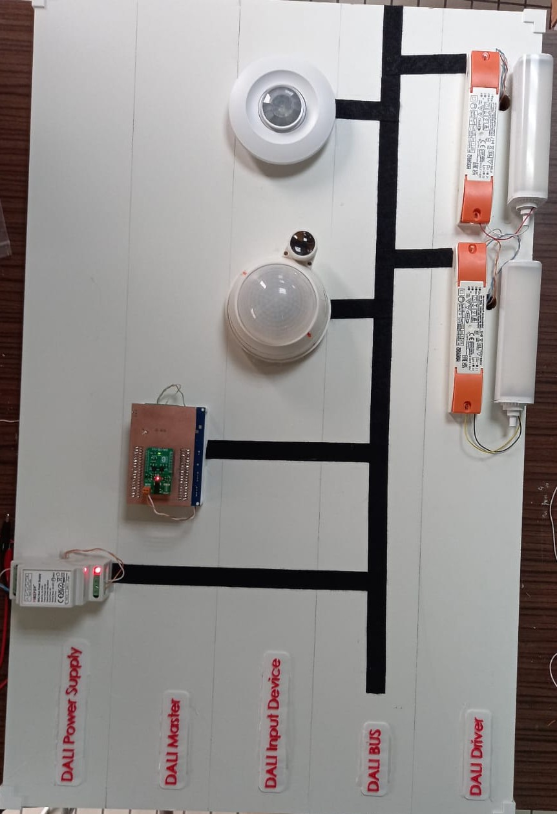

# DALI-Based-Lighting-System-with-ESP32
# DALI-Based Lighting System with ESP32

## 🔧 Project Overview
This project implements a DALI-2 lighting control system using an ESP32 and a DALI2 Click module. It serves as an educational platform to demonstrate intelligent lighting control, addressability, and protocol communication in real time.

## ⚙️ Hardware Setup
- ESP32-based custom PCB as DALI Master
- DALI2 Click board interface
- DALI-compliant power supply
- 2x DALI motion sensors
- 2x DALI LED drivers with lamps

## 💻 Software Features
- MATLAB App for controlling the system via HTTP
- Scenario-based testing of addressability, group commands, and dimming

## 📸 Visuals

